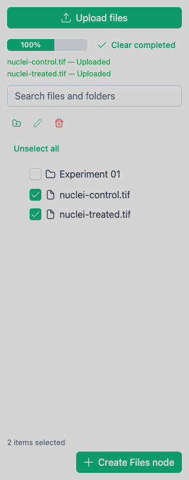

# Manage Browser Datasets

> **Available in:** Browser only. The **Datasets** panel is absent from the desktop application.

The **Datasets** panel stores files managed by the browser deployment.
Open it with **View → Datasets Panel**.

## Upload files

1. Select the destination folder, if needed.
2. Click **Upload files**.
3. Choose one or more local files.
4. Wait for each upload to finish.

Use **Cancel**, **Retry**, or **Dismiss** on an individual upload when offered.
Use **Cancel uploads** for active uploads or **Clear completed** to remove finished notifications without deleting files.

Dragging local files anywhere onto the browser application also uploads them into managed storage and selects them after completion.

## Organize files

Use **Add folder**, **Rename**, and **Delete** above the dataset tree.
Drag managed items between folders to move them.
Use **Search files and folders** to filter the tree.

Before deletion, BioImageFlow shows how many managed files and folders will be removed.
Folder contents are included.

## Select workflow input

Use the checkboxes beside files and folders.
Selecting a folder includes its descendants.
Clearing one child leaves the folder partly selected.

Then choose one action:

- **Create Files node** adds a new **Files** node to the active canvas.
- **Set files on “node name”** replaces the file list on the selected compatible **Files** node.
- Drag managed files or folders from the tree onto the canvas.

The selected order is resolved from the dataset tree.
Managed folders become explicit file lists, not filesystem **Directory** values.

Use **Unselect all** when you are finished.
Return to [Choose Input Data](choose-input-data.md) to connect the Files node to the rest of the workflow.
