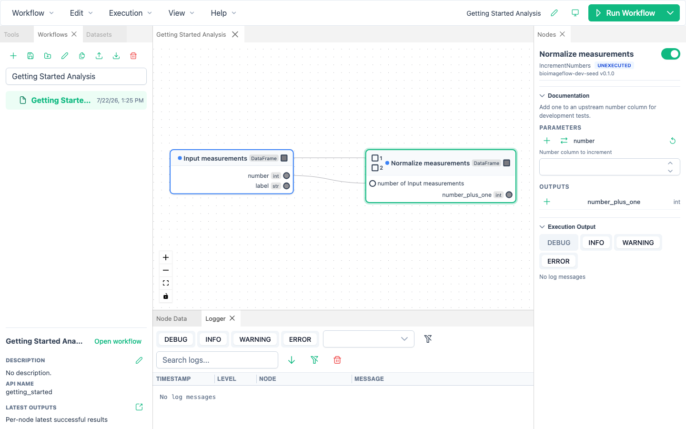

# Build a Workflow

A workflow is a directed graph.
Tool nodes perform analysis steps, edges move data between steps, and workflow nodes contain complete reusable workflows.

## Create and save a workflow

1. Choose **Workflow → New** or click **New workflow** in the **Workflows** panel.
2. Enter a workspace name, display name, and optional description.
3. Add and configure nodes.
4. Choose **Workflow → Save** or press Ctrl/Cmd+S to publish the accepted draft to the saved workflow.

Canvas edits are synchronized to a durable draft after they are accepted.
This protects in-progress work and lets the application recover it, but the saved `workflow.json` changes only when you explicitly save.
An asterisk in the window or tab title indicates changes that have not been promoted to the saved workflow.

## Add tool nodes

Search in the **Tools** panel, then drag a tool onto the canvas.
You can also use the tool's add button.
BioImageFlow assigns a unique node identity while showing the tool's readable name.

Select the node to edit it in the **Nodes** panel.
Double-click the displayed node name to rename the instance without changing which tool it runs.
Disable a node when you want to keep it in the graph without scheduling it.

## Configure inputs

The **Parameters** section uses controls that match each tool input, including text, numbers, choices, checkboxes, paths, and nullable values.

- **Reset to default** restores the tool-defined value.
- **Set to null** deliberately passes no value when the input allows it.
- **Add input pin** exposes a parameter as a connectable handle on the node.
- **Expose as workflow input** makes the value part of the containing workflow's public interface.

For file or folder parameters, use the picker button instead of typing a path when possible.
Managed datasets can also populate compatible Files nodes from the **Datasets** panel.

## Connect nodes

Drag from an output handle to a compatible input handle.
BioImageFlow supports two edge kinds:

- a column edge carries one named output field into one input;
- a DataFrame edge carries an entire table into a positional or named DataFrame input.

Handle labels help you choose endpoints, but compatibility is validated from their underlying data roles.
The application prevents obvious cycles immediately, and the backend performs authoritative recursive validation before accepting or running the graph.

## Configure outputs

The **Outputs** section lists the fields produced by the tool.
You can expose an output as a workflow output and give the public port a readable name.
Changing the name preserves existing connections because the port has a stable internal identity.

An output path template controls where a tool writes a file within workflow-managed storage.
Use relative, meaningful paths and keep output names distinct when a tool produces several assets.

## Edit the graph efficiently

- Shift-click to select several nodes.
- Use Ctrl/Cmd+C and Ctrl/Cmd+V to copy and paste complete selections.
- Use Delete or Backspace to delete the selection.
- Use Ctrl/Cmd+Z and Ctrl/Cmd+Shift+Z for undo and redo.
- Press F while the canvas is focused to fit the graph in view.
- Press Ctrl/Cmd+A to select all nodes on the active canvas.

Copying a workflow node includes its complete nested graph.
Cross-workflow paste also stages the workflow-local tool sources required by the copied content.

## Group nodes into a workflow

Select one or more nodes, right-click one of them, and choose **Group into workflow**.
BioImageFlow replaces the selection with one workflow node in a single undoable change.
Incoming and outgoing connections become workflow inputs and outputs, while internal and detached branches are preserved.

See [Reuse and nest workflows](nested-workflows.md) for editing, saving, and updating the resulting workflow node.

## Correct validation problems

Global graph problems appear in a banner above the canvas.
Node and parameter problems also appear on the affected node or field.
Select the named node, correct the highlighted field or connection, and wait for draft synchronization to finish before saving or running.

Validation paths can include nested workflow names, such as `segment_and_measure/cellpose_segmenter`.
Use each part of the path to open the relevant nested editor and locate the failing tool.
