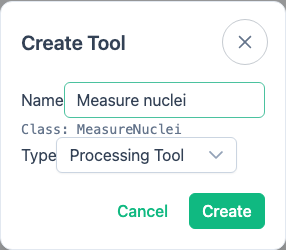

# Create Custom Tools

> **Available in:** Desktop and trusted browser deployments. Source editing depends on the editor configured by the deployment.

Start with a workflow-local tool when the code belongs to one analysis and should travel with that workflow when exported.
Use a reusable tool package when several workflows or people need the same versioned implementation.

## Create a workflow-local tool

1. Open or create the workflow that should own the source.
2. Save the workflow.
3. Click **Create Tool** at the bottom of **Tools**.
4. Enter a readable **Name**.
5. Choose **Processing Tool** for work on files or **DataFrame Tool** for table operations.
6. Click **Create**.
7. Complete the generated Python source in the embedded or configured external editor.



The dialog shows the Python class name generated from your entry and prevents a name collision with an existing tool.
When you save the source, BioImageFlow reloads its tool information.
Nodes can be marked out of date if that information changes.

Open **Manage tools** to open, rename, or delete editable workflow-local tools.
Before deletion, BioImageFlow identifies saved workflows that still use the tool.

```{warning}
Custom tools execute Python code.
Review code from collaborators before running it, and do not place passwords or access tokens in the source.
```

## Create a reusable tool package

Choose a package when the tool needs releases, version selection, reuse across workflows, or distribution to other users.
Packaging is separate from the **Create Tool** dialog.

Follow the [BioImageFlow library guide to creating a custom tool](https://bioimageflow.readthedocs.io/en/latest/how-to/custom_tool.html) for the package structure and Python API.
After publishing or archiving the package, install it through [Find and Manage Tools](data-and-tools.md#install-a-package-from-another-source).
