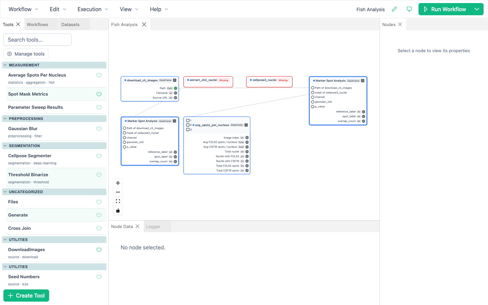

# Interface Tour

BioImageFlow uses a dockable desktop layout built around a workflow canvas.
Panels can be resized, rearranged, placed in tab groups, or reopened from the **View** menu.

## Menu and execution controls

The menu bar contains five menus:

- **Workflow** creates, opens, saves, imports, exports, builds, and deletes workflows.
- **Edit** provides undo, redo, clipboard actions, selection, and Preferences.
- **Execution** provides full, selected, retry, invalidation, recompute, and stop commands.
- **View** shows or hides the main panels.
- **Help** opens application information.

The active workflow's display name appears on the right side of the menu bar.
The adjacent pencil edits that display name without changing the workflow's workspace path.
The error indicator opens persistent error history, the theme button selects light, dark, or system appearance, and the split **Run Workflow** button exposes execution alternatives.

## Canvas and tabs

Each opened root workflow has its own canvas tab.
A workflow used as a node can open in another nested-editor tab.
The active tab determines which graph the **Nodes**, **Node Data**, Save, undo, redo, and clipboard commands affect.

On the canvas you can:

- drag nodes and connect their handles;
- drag an empty area to pan and use the mouse wheel to zoom;
- use the canvas controls to zoom or fit the graph;
- click a node to select it, or hold Shift to select several nodes;
- right-click a node for rename, enable, grouping, source, and delete actions;
- double-click a workflow node to open it.

A thick-bordered node represents a workflow embedded inside another workflow.

## Main panels

### Tools

Search and browse available tools by category.
Drag a tool onto the canvas or use its add action to create a node.
Hover over a tool for documentation, source-editing, and environment actions.
Use **Manage Tools** for package versions, environment state, and custom tool management.

### Workflows

Browse saved workflows and folders.
The toolbar creates, saves, duplicates, imports, exports, edits, and deletes items.
Drag a saved workflow onto the canvas to embed a reusable snapshot.

### Datasets

Upload, organize, select, and delete managed input files.
Selected files can create a **Files** node or populate an existing selected Files node.

### Nodes

Select one canvas node to edit its name, enabled state, parameters, input pins, workflow interface exposure, resources, output templates, and node-scoped logs.
With several nodes selected, the panel shows multi-selection information instead of editable fields.

### Node Data

Inspect completed outputs for the selected nodes.
The table supports pagination, filtering, path actions, lazy image thumbnails, and viewer actions.
The **View** menu calls this panel **Data Table**.

### Logger

Filter messages by severity, execution, node, and text.
Auto-scope follows the selected node, while auto-scroll keeps the newest messages visible.
Clearing this panel removes displayed log entries from the current interface; it does not delete workflow outputs.

### Code Editor

Displays workflow-local tool source through the configured embedded or external editor integration.
Custom source belongs to its workflow so that exported workflows can carry the tools they need.

## Appearance and layout

Use the theme button near **Run Workflow** to choose **Light**, **Dark**, or **System**.
Panel visibility and the theme are interface preferences; they do not change workflow results.
