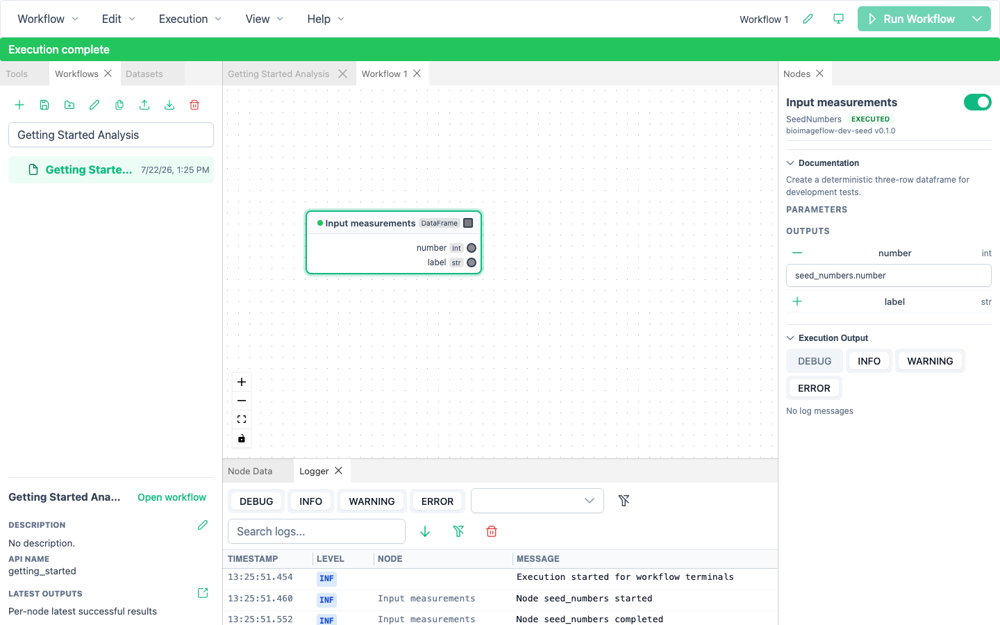

# Reuse and Nest Workflows

A workflow can appear as a node inside another workflow.
The embedded node contains a complete executable snapshot, so a parent remains reproducible even if the saved source workflow later changes or is deleted.

## Create a nested workflow

There are two common approaches:

- select canvas nodes, right-click, and choose **Group into workflow**;
- drag a saved workflow from the **Workflows** panel onto another workflow's canvas.

Grouping creates a new embedded graph from the selection.
Dragging a saved workflow embeds its exact saved graph, its public inputs and outputs, and any workflow-local source files it needs.

BioImageFlow rejects direct and indirect containment cycles.
For example, workflow A cannot embed workflow B if B already contains A at any depth.

## Connect a workflow node

Workflow nodes use a thick border.
Their visible handles come from the embedded workflow's public interface.

Inside the nested graph, expose a tool parameter with **Expose as workflow input** or an output with **Expose as workflow output**.
Give each exposed port a clear name in the **Nodes** panel.
Renaming a port preserves its parent connections, but removing or changing a connected port requires confirmation and removes incompatible edges or bindings atomically.

## Edit nested content

Double-click a workflow node, or right-click it and choose **Open workflow**.
BioImageFlow opens the embedded graph in a nested editor tab using the same canvas and panels as a root workflow.

Nested edits are private to that editor until you save them back to the parent node.
Press Ctrl/Cmd+S or choose **Workflow → Save** while the nested tab is active to apply the accepted snapshot.
Saving preserves compatible parent edges and bindings by port identity.

Closing a dirty nested tab asks whether to discard its private changes.
You cannot run a nested tab directly; save it into the parent and run the owning root workflow.

If the parent node changed or disappeared after you opened the editor, applying reports a conflict and changes nothing.
Choose the latest snapshot or keep your changes from the persistence message before continuing.

## Understand saved-source provenance

A workflow dragged from the Workflows panel remembers which saved workflow and artifact produced the embedded snapshot.
This provenance is informational until you request a source action.
Editing the embedded copy never edits the saved source automatically.

Right-click a workflow node with saved-source provenance to use:

- **Open source workflow**, which opens the saved source in its own root tab;
- **Update from source**, which previews differences and replaces the embedded snapshot after confirmation;
- **Detach from source**, which removes provenance while keeping the embedded content unchanged.

An update checks the source and destination again when you confirm it.
If either changed, or if an editor is open at or below the replacement target, BioImageFlow refuses the operation without making a partial change.

Deleting, renaming, or editing a saved source does not silently mutate existing embedded copies.

## Copy between workflows

Copying a workflow node includes every nested graph below it.
Pasting assigns new parent node and edge identities while preserving the public port identities inside the copied workflow.
When the copied graph uses workflow-local tools, the destination receives content-addressed copies so same-named tools with different source can coexist.
