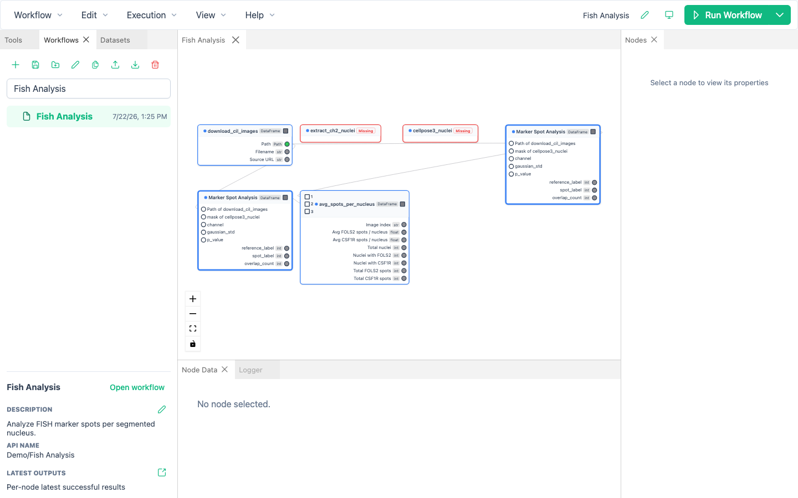

# Quick Start

This walkthrough opens an example workflow, runs it, and inspects the results.
The examples download their public input images when they run, so keep an internet connection available.

## 1. Open an example

BioImageFlow installs **Fish Analysis** and **Parameters Space Exploration** in the **Demo** folder when it creates a new workflow root.

1. In the **Workflows** panel, expand **Demo**.
2. Select **Fish Analysis** to read its description.
3. Click **Open workflow**.

If the Demo folder is missing, open **Edit → Preferences… → Storage** and click **Install demos**.
BioImageFlow never overwrites a workflow that already occupies an example's canonical location.

## 2. Resolve missing tools

Example workflows use separately distributed tool packages.
If BioImageFlow reports missing packages, the dependency dialog identifies the required versions and affected nodes.
Click **Install all missing packages** in the dependency dialog to install every exact required version, or open **Manage Tools** at the bottom of the **Tools** panel to install versions individually.
When alternatives are already installed, **Use installed alternatives…** can rebind the workflow after you confirm the version substitutions.

Package installation may create analysis environments and can take time.
Wait for the package and tool lists to refresh before running.

## 3. Run the workflow

Click **Run Workflow** in the upper-right corner.
BioImageFlow validates the accepted workflow draft before starting.
If a validation message names a node or field, select that node and correct the value in the **Nodes** panel.

While execution is active:

- the execution banner reports progress;
- nodes change status as they are scheduled and completed;
- graph editing is locked so the running graph cannot change;
- the **Logger** panel receives workflow and tool messages.

The first run may be slower because it prepares tool environments and downloads the example data.

## 4. Inspect results

Select a completed node and open the **Node Data** panel.
The panel shows tabular results, image thumbnails, and output paths for the selected node.
Use the actions beside an image or path to reveal it in the file browser, copy its path, or open it in an available viewer.

Select several nodes to compare their outputs in one panel.
If their rows can be aligned, BioImageFlow presents a merged table; otherwise it shows one table per node.

To inspect files outside the application, select the saved workflow in the **Workflows** panel and click **Open latest outputs**.
The `latest` directory contains the most recent successful result for each node.
It can combine results from different executions, so it is not a frozen snapshot of one complete run.

## 5. Make an editable copy

Keep the bundled example intact and create a copy before experimenting:

1. select the workflow in the **Workflows** panel;
2. click **Duplicate workflow**, or choose **Workflow → Save As** while it is open;
3. give the copy a new workflow name and display name;
4. adjust parameters or graph structure, then choose **Workflow → Save**.

Continue with [Build a workflow](build-workflows.md) for a complete explanation of graph editing.
