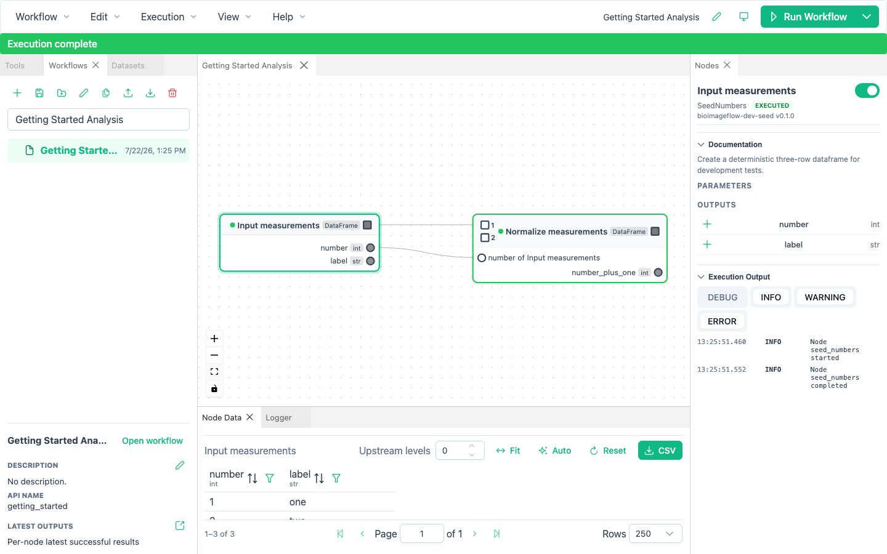

# Run Workflows and Inspect Results

BioImageFlow executes the exact accepted draft revision of a saved root workflow.
It validates the recursive graph, prepares a flat execution plan internally, and preserves nested paths in statuses, logs, caches, and errors.

## Choose an execution command

Use the split **Run Workflow** button or the **Execution** menu:

- **Run Workflow** schedules the enabled workflow.
- **Run Selected** schedules selected nodes and the enabled dependencies required to complete them.
- **Retry Failed Execution** repeats the original target set while reusing successful cached work.
- **Invalidate Failed Nodes and Retry…** invalidates failed nodes and their downstream cache selections before retrying the original targets.
- **Recompute Workflow…** invalidates every enabled node before a complete run.
- **Stop** requests cancellation of the active execution.

Selecting a workflow node for **Run Selected** targets that workflow boundary and schedules its enabled internal completion dependencies.

Invalidation changes which cached results may be selected for the next run.
It does not immediately delete retained cache records or reclaim disk space.

If nodes are out of date, BioImageFlow lists them and asks whether to rebuild them before running.

## Follow execution

While a run is active, graph mutation is locked on root and nested canvases.
You can still select nodes, inspect existing data, and read logs.

The execution banner summarizes the active run and the nodes display states such as waiting, running, completed, cached, failed, or cancelled.
A workflow node aggregates the status of its descendants while retaining the scoped path of a failure or cancellation.
Even a detached failing branch makes its containing workflow fail and prevents downstream consumers from running.

Use **Stop** when you need to cancel.
Cancellation can take a short time while the current tool responds and environments settle.

Open **View → Execution** for retained run history and independent progress for every node job.
Direct, Wetlands, and Parsl runs use the same hierarchical view.
See [Distributed execution](distributed-execution.md) for target selection, remote input preparation, cluster reconnection, and result downloads.

## Read logs and errors

The **Logger** panel receives application, workflow, and tool messages.
Filter by severity, execution, node, or text, or enable auto-scope so selection chooses the node filter.
Node-scoped logs also appear at the bottom of the **Nodes** panel.

The error indicator near the theme control records execution, validation, API, WebSocket, and application errors.
Open it to mark entries as read, inspect technical details, or use **Go to node**.

Global validation failures appear above the canvas.
Parameter failures appear beside the affected field when the backend can identify it.
Nested failures use slash-separated paths that identify each workflow boundary.

## Inspect output tables

Select one or more nodes and open **Node Data**.
For a single node, the panel shows its latest available tabular output.
Use column filters and pagination to inspect larger results.

With several selected nodes, BioImageFlow merges compatible row-aligned outputs when it can.
Otherwise it displays separate tables for the selected nodes.
If a selected node is disabled or has no result, the panel explains why it cannot display data.

## Inspect paths and images

Path cells provide actions to reveal the file in the system file browser and copy its full path.
Image paths also show lazy thumbnails when the format can be rendered.

Use **Open in Napari** to let the platform provision and launch its managed Napari environment on first use.
Ctrl/Cmd-clicking that action clears the existing Napari layers before adding the selected image; an ordinary click adds the image to the current viewer session.

Use **Open in Avivator** to inspect a supported image in an embedded web viewer.
This action requires network access to the Avivator service.

## Open latest output files

Select a saved workflow in the **Workflows** panel and click **Open latest outputs**.
BioImageFlow publishes a file-browser-friendly view under that workflow's output storage.

`latest` means the latest successful result independently for each node.
After selected, failed, cancelled, or overlapping runs, the directory can contain results produced by different executions.
Use the in-application execution and cache information when you need to reason about one exact run.

BioImageFlow keeps this disposable view lightweight.
It uses symbolic links when available and portable pointer files otherwise; **Preferences → Storage** reports the effective mode.
Do not treat the view itself as a portable backup.

Choose **Workflow → Export**, then **Latest results**, when you need independent copied files with the same per-node latest semantics.
Choose **Workflow → Export**, then **Workflow with results**, when you need one pinned successful run together with the workflow and provenance.
See [Import and export](manage-workflows.md#import-and-export) for all export choices.
